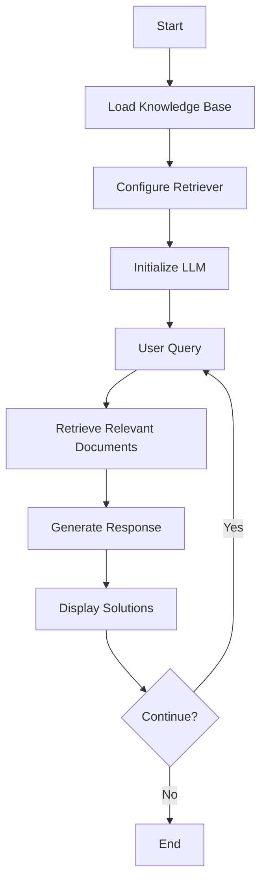

# Tech Support Agent with LLM

This project implements a technical support agent that utilizes a large language model (LLM) to provide assistance with Apple product issues. The agent leverages a knowledge base of documents and retrieves relevant information to answer user queries.

## Workflow



## Features

* Accesses a knowledge base of Apple product documents (PDF, ePub, Word documents, TXT files)
* Retrieves relevant documents based on user queries
* Generates responses using a large language model (currently set to gpt-4)
* Provides up to 4 most likely solutions to user problems based on the knowledge base
* Maintains a conversation history to improve context for subsequent queries

## Requirements

* Python 3.7+
* OpenAI API Key (set via environment variable `OPENAI_API_KEY`)
* langchain library

## Installation

1. Install langchain:
   ```bash
   pip install langchain
   ```

2. Set your OpenAI API key:
   - Create an OpenAI account and obtain an API key.
   - Set the `OPENAI_API_KEY` environment variable with your key value:
     ```bash
     export OPENAI_API_KEY='your-api-key-here'
     ```

## Usage

1. Prepare your knowledge base:
   - Place your Apple product documents (PDF, ePub, Word, TXT) in a folder.

2. Update the script with the path to your knowledge base folder.

3. Run the script:
   ```bash
   python tech_support_agent.py
   ```

4. The script will load your documents, configure the retriever and LLM, and start a chat session where you can ask questions about Apple products.

## Example

**Input:**
```
You: My iPhone screen is cracked. What should I do?
```

**Output:**
```
Tech Support Agent: Here are 4 closest suggestions for your cracked iPhone screen:
1. Schedule an appointment at an Apple Store for a screen replacement.
2. Visit an Apple Authorized Service Provider for screen repair.
3. If your iPhone has AppleCare+, you might be eligible for a discounted screen replacement.
4. Depending on the severity of the crack, you might be able to continue using your iPhone with a protective case.

Is there anything else I can help you with?
```

**Note:** This is a fictional example, and the actual number of suggestions and their content may vary depending on the knowledge base and the user's query.

## Additional Notes

* This is a basic example, and the agent can be further customized to improve the quality and accuracy of the responses.
* The provided documents should be relevant to Apple product troubleshooting and support.
* Consider fine-tuning the retrieval process and prompt engineering for better results.

## Customization

You can customize the agent by modifying the following:

- Change the LLM model by updating the `llm` variable in the script.
- Adjust the number of solutions provided by modifying the prompt template.
- Implement additional preprocessing steps for the knowledge base documents.

## Contributing

Contributions are welcome! Please feel free to submit a Pull Request.

## License

This project is licensed under the [MIT License](LICENSE).

## Troubleshooting

If you encounter issues:
- Ensure your OpenAI API key is correctly set.
- Check that your knowledge base documents are in supported formats.
- Verify that you have the latest version of langchain installed.

## Future Improvements

- Implement a web interface for easier interaction.
- Add support for multi-turn conversations and context retention.
- Integrate with ticketing systems for seamless support workflows.
